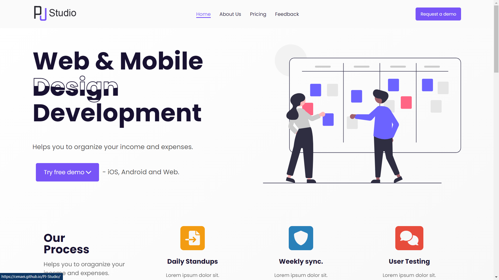

<!-- PROJECT LOGO -->
 

  

<h3 align="center">Frontend Mentorship Program</h3>

  

    My Practice Codes for Frontend-Mentorship-Program with Dan Salahi!
     
    <a href="https://github.com/cenaei"><strong>More by me »</strong></a>
     
     
    <a href="https://github.com/cenaei">Final Project [soon]</a>
    ·
    <a href="https://github.com/cenaei/frontend-mentorship-challenge/issues">Report Bug</a>
    ·
    <a href="https://github.com/cenaei/frontend-mentorship-challenge/issues">Request Feature</a>
  

<!-- ABOUT THE PROJECT -->
## About The Project

This is a simple landing page for PJ Studio. :)

(<a href="#top">back to top</a>)

### Built With

* [HTML](https://html.spec.whatwg.org/)
* [CSS](https://www.w3.org/TR/CSS/#css)
* [SASS](https://sass-lang.com/) soon
* [JS](https://www.javascript.com/)
* [jQuery](https://jquery.com/)

(<a href="#top">back to top</a>)

<!-- CONTACT -->
## Contact

Sina Sangiji - [@cenaei](https://twitter.com/twitter_handle) - sina.sangiji@gmail.com

(<a href="#top">back to top</a>)

<!-- ACKNOWLEDGMENTS -->
## Acknowledgments

* [Build My Readme By](https://github.com/othneildrew/Best-README-Template)

(<a href="#top">back to top</a>)

